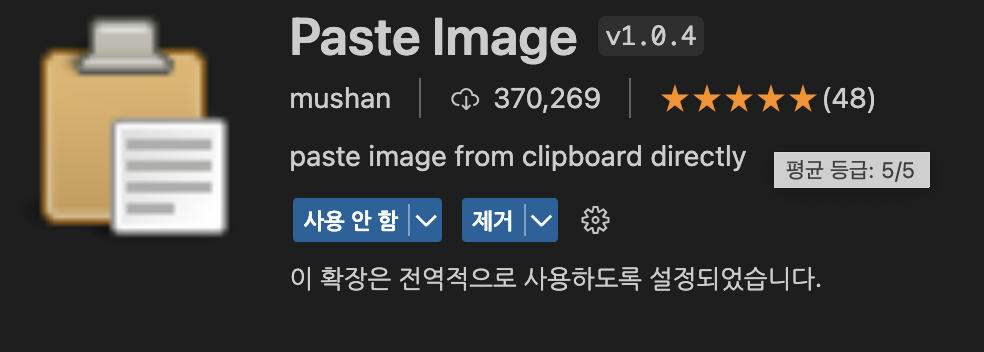

## 발단
`github blog`를 시작하면서, 가장 불편한 점은 이미지의 삽입이었다. 
노션의 경우에는 클립보드에 저장된 이미지를 그대로 붙여넣기 하면 되었는데, `github blog`같은 경우에는 일일이 경로에 저장하고, 불러오는 방식으로 해야했다.

## 서칭
vscode에 유용한 익스텐션이 없을까 하다가 Paste Image를 알게되었다.

이 익스텐션을 사용 시 클립보드에 저장된 이미지를 지정한 폴더에 저장해주고, 이 후 지정한 곳에 붙여넣어준다. 

이렇게 편리할 수가...?
> [Paste Image 바로가기](https://marketplace.visualstudio.com/items?itemName=mushan.vscode-paste-image)

---
## 💡사용 방법
익스텐션의 설정 아이콘을 눌러 Paste Image Configuration으로 간다.
### Paste Image : Base Path
붙여넣기 시 그림이 입력될 곳을 넣는다.  
`${currentFileDir}` : 현재 열려있는 파일  
`${projectRoot}` : 프로젝트의 root 폴더

### Paste Image : Default Name
저장되는 이미지의 이름을 지정한다.

### Paste Image : Path
붙여넣기 시 그림이 저장될 곳을 지정한다.

### 🐝 꿀팁
Windows의 경우 현재 화면 캡쳐는 win + alt + s
MacOS의 경우 cmd + shift + 4
(바탕화면에 저장없이 클립보드에 올리고 싶다면 영역 캡쳐 시 control을 눌러주며 드래그한다.)